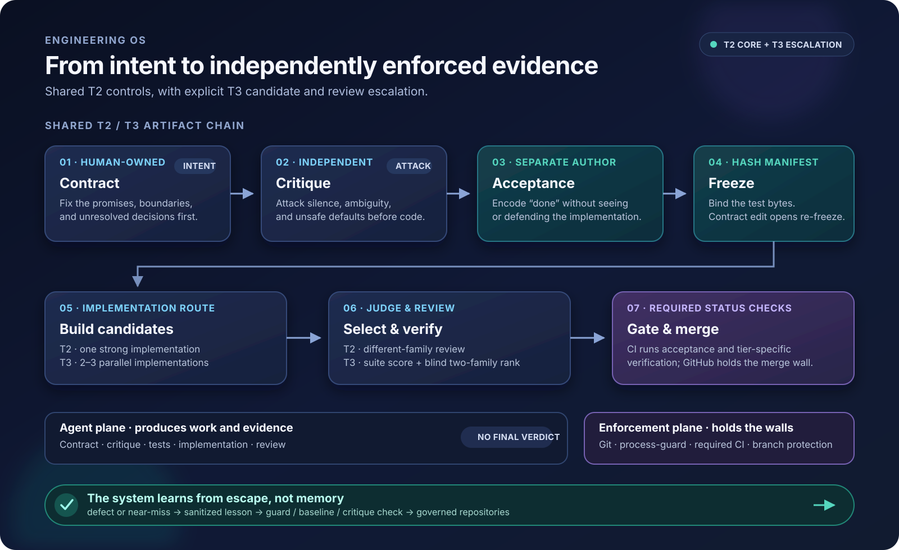

# Engineering OS

**Ship software with AI agents—without trusting them to follow rules.**

This repository contains a risk-based delivery process, agent prompts, onboarding
templates, and a CI guard for AI-assisted software development. When its status checks
are required by branch protection, GitHub—not the agent that produced the work—holds
the merge boundary.

  

<a href="docs/engineering-os-overview.svg">Open the full-size diagram</a>

> The diagram shows the shared **T2/T3 path and its T3 escalation**. T3 requires 2–3
> parallel candidates, frozen-suite judging, blind two-family review, and stronger
> verification. T0, T1, and documentation changes take lighter routes defined in
> [`POLICY.md`](POLICY.md).

## Three principles

- **Rules become checks, or they do not count.** Important instructions should not
  decay into optional prose.
- **The orchestrator never guards itself.** An AI-driven system should not approve its
  own evidence.
- **Every gate checks its inputs.** A green result from missing, wrong, or silently
  skipped evidence proves nothing.

For T2/T3 work, the acceptance-test author is separate from the implementer.
`process-guard` checks the frozen test files and hash manifest from Git history rather
than trusting the pull request’s working tree.

## Process follows risk

[`POLICY.md`](POLICY.md) classifies the **change**, not the diff size:

| Change | Route |
|---|---|
| **T0 — mechanical** | Normal pull request + CI floor |
| **T1 — behavior, no trust boundary** | Pipeline default-on; explicit audited skip possible |
| **T2 — trust boundary** | Critique → frozen independent acceptance → implementation → cross-family review |
| **T3 — novel or critical boundary** | T2 controls + 2–3 candidates + frozen-suite judging + blind two-family review |
| **Docs** | Claims-vs-enforcement pass + guarantee-verb grep |

High-risk changes get more checks. A rename should not use the same process as a change
that can leak credentials, widen permissions, corrupt evidence, or write unsafe state.

## Try it in one repository

1. Use [`ONBOARDING.md`](ONBOARDING.md) to declare the repository tier and add the
   [`agent context`](templates/agent-context-block.md).
2. Introduce the acceptance-suite manifest or the temporary onboarding exemption in
   the order described there.
3. Add [`process-guard`](process-guard/) to CI and make the repository’s verification
   jobs required status checks in branch protection. For a T2 surface that can edit
   its own guard, also require the [base-ref materialized guard](process-guard/README.md#usage);
   fully closing workflow-definition tampering needs a ruleset-required workflow.
4. Start work from [`DISPATCH.md`](DISPATCH.md), or install the optional
   [Claude Code plugin](plugins/engineering-os/) to make the compliant path easier.

The plugin helps run the steps. It does not replace CI or branch protection.

## Where to go next

| I want to… | Read |
|---|---|
| Understand the authoritative system | [`OS.md`](OS.md) |
| Start a change | [`DISPATCH.md`](DISPATCH.md) |
| Choose verification depth | [`POLICY.md`](POLICY.md) |
| Onboard a repository | [`ONBOARDING.md`](ONBOARDING.md) |
| See every control and its origin | [`BASELINE.md`](BASELINE.md) + [`LESSONS.md`](LESSONS.md) |
| Inspect the enforcement | [`process-guard/`](process-guard/) |
| Reuse the four agent roles | [`prompts/`](prompts/) |
| Understand changes to this OS itself | [`contracts.md`](contracts.md) |

## The human decides what is correct

Before coding starts, the human decides what the software must do and which risks are
acceptable.

AI critics can help find:

- unclear requirements;
- missing cases;
- unsafe alternatives;
- rules that different implementers could understand differently.

The human resolves those questions in the contract. Acceptance tests and CI then help
keep the implementation aligned with that decision. They do not decide whether the
contract itself is correct.

## Honest limits

- **Contract decisions:** AI critique can expose gaps, but the human remains responsible
  for deciding what is correct and which risks to accept.
- **Tests for each feature:** The pipeline, audit, and human review check
  feature-specific coverage. The current CI freeze gate only proves that a global
  frozen test suite exists.
- **Changing frozen tests:** Any configured contract-file change opens the re-freeze
  path for all listed tests, not only related tests. The guard checks files and hashes;
  human review decides whether the contract change genuinely justifies each test
  change.
- **Protecting CI:** Checks stored in the repository cannot fully protect their own
  workflow files. Stronger protection requires a trusted workflow enforced by a
  repository ruleset.
- **Different authors:** Separate authors reduce accidental blind spots, but they are
  not a hard identity boundary. A repository owner can deliberately bypass this
  separation. The monthly audit checks author separation.

See [`OS.md`](OS.md), [`BASELINE.md`](BASELINE.md), and
[`contracts.md`](contracts.md) for detailed controls and accepted risks.

## License

Apache-2.0. If you copy this process, I would genuinely like to hear what broke first.
